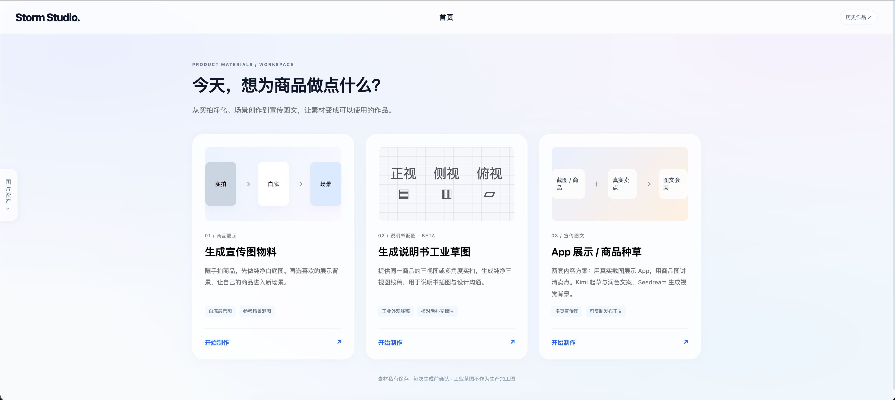
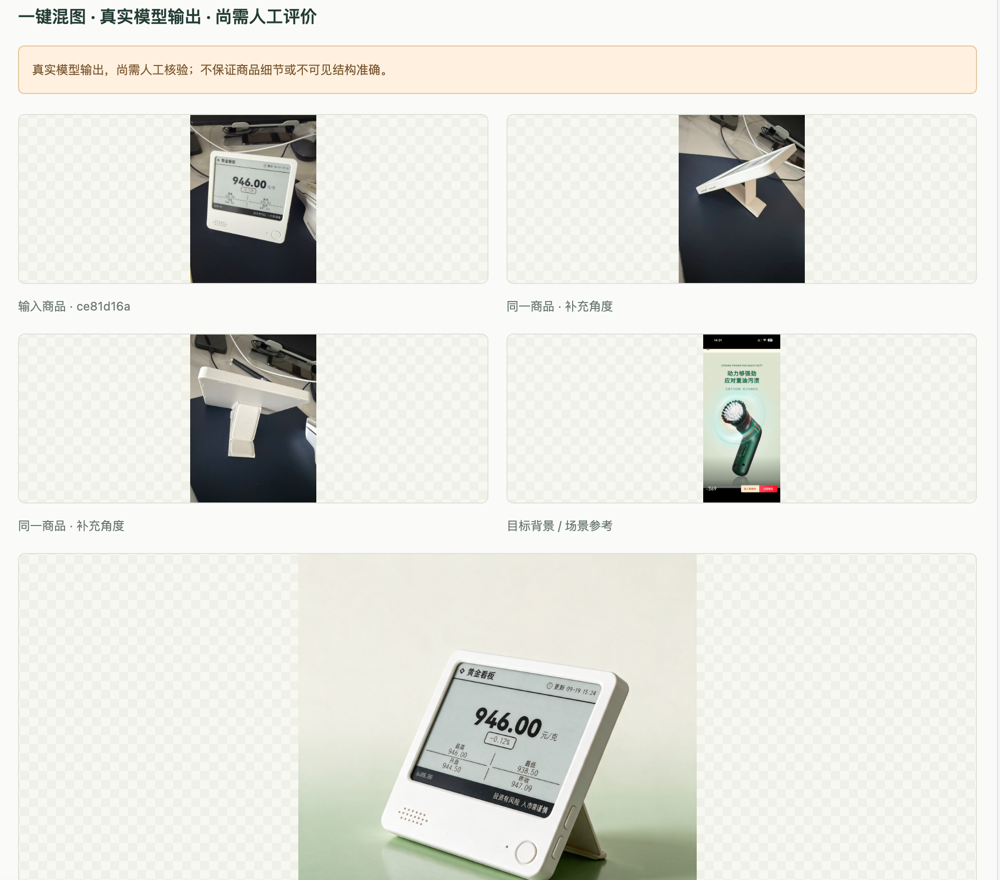

# Storm Studio.

[简体中文](README.md) | **English**

**v0.1 Beta** · A tool for creating product images and promotional visuals with copy. See [CHANGELOG.md](CHANGELOG.md) for release notes.

An e-commerce image workbench with account isolation and three tools: **promotional images, industrial sketches for manuals, and app showcases / product promotion**. It uses Kimi for drafting and refining copy, Seedream for image generation, and local U²-Net for background removal.

## Try it online

**[Open Storm Studio](https://stormstudio.top)** · An HTTPS web experience with email-code registration and login. Registration is disabled when email delivery is not configured. Standard accounts receive three image generations; the primary account has no generation-count limit. Images and history are isolated by account. Login credentials are not included in this repository. You can also self-host using the instructions below.



## Example results

Combine front, side, and rear photos of the same product with a reference scene to generate a new product presentation image. The comparison below shows actual workbench inputs and outputs. Product structure, screen text, logos, and other details still need human review.



## Accounts and quotas

The server uses email-verified registration and application login; the original primary account, `studio`, is retained. SMTP must be configured before registration is enabled; registration fails closed without it. Local installations can still run in single-user mode by default.

Each generated image costs one credit, including each image in a batch. Copywriting, downloads, and local background removal do not consume image credits. Credits are reserved at submission and refunded on definite failure. Unknown outcomes, such as timeouts, keep their reservation. Concurrent or duplicate submissions cannot exceed the quota; batches are rejected if there are not enough credits for the whole batch. Standard accounts can submit at most 20 tasks per day. Public-account model calls share a default site-wide limit of 30 per day, with additional IP, email, and generation-endpoint rate limits. See [multi-user deployment](docs/ACCOUNTS.md) for account initialization, password resets, backups, and deployment.

## Start locally

Use Python 3.11 and run from the project root:

```sh
uv sync --locked
cp .env.example .env
uv run alembic upgrade head
uv run python scripts/setup_cutout.py
```

The last command downloads background-removal model weights on the first run and verifies existing files on later runs. It does not need to run every time.

Start these commands in separate terminals:

```sh
uv run uvicorn studio.web.app:app --host 127.0.0.1 --port 8765 --no-access-log
```

```sh
uv run python -m studio.worker
```

Open the [local workbench](http://127.0.0.1:8765/). It binds only to localhost. The worker needs outbound network access to call real models; run it in a local terminal with appropriate access. Press Ctrl+C in each terminal to stop.

## Usage

Choose a tool on the home page. Add source material by clicking a product-image card, dragging files in, or pasting images. Open the image-assets drawer at any time to manage assets. The white-background tool has two cards for the product and result; the scene and industrial-sketch tools have three cards for the product, reference scene / additional angles, and result, with actual local work displayed below.

- **Promotional images:** a single product photo (additional angles are not accepted in the white-background stage) → clean white-background product image → download directly or remove the background for a transparent PNG. Alternatively, select a reference scene and blend the product into your own promotional scene. Scene-blending results do not offer background removal.
- **Industrial sketches for manuals · Beta:** three-view or multi-angle photos of the same product → clean three-view line art. Intended as a first draft for manual illustrations, with human review and annotations required; not for manufacturing.
- **App showcases / product promotion:** upload actual app screenshots or product photos and enter the name and factual selling points → draft copy with Kimi → edit or optionally refine it → generate the first page's visual background with Seedream → approve the remaining pages → download the image set and post copy. The program lays out the real assets and text over the backgrounds. The initial format is 3:4 with 3–6 pages. Nothing is published automatically.

Preview images, requirements, and call counts before confirming model calls. For multiple products in a scene-blending batch, approve the first image before authorizing the rest. Open existing work from the history page.

Supported canvas ratios: 1:1, 3:4, 4:3, 4:5, 5:4, 2:3, 3:2, 9:16, and 16:9. Returning home and entering a tool starts an empty task. “New task” in the upper-right corner clears the current configuration while retaining assets and history.

The current interface exposes three creation tools. Older experimental APIs and records remain for compatibility and are not current tool entry points.

## Configuration

Only the project's own `.env` is loaded, with environment variables taking precedence. Keys are not displayed on the page or included in exports. Set `MOONSHOT_API_KEY` and `ARK_API_KEY`; the configured models are `kimi-k3` and `doubao-seedream-5-0-pro-260628`. See `.env.example` for options. Restart both the web service and worker after configuration changes.

```sh
uv run python -m studio.config
```

This command reports only whether settings are present, never their secret values. Relative `STUDIO_DATA_DIR` paths are resolved from the project root. `.env`, models, and `data/` are ignored by Git. Do not upload local credentials. Public access must use a protected HTTPS reverse proxy.

## Validation and limitations

```sh
uv run pytest -q
uv run ruff check src tests migrations scripts
uv run ruff format --check src tests migrations scripts
node --check src/studio/web/static/app.js
node --test tests/frontend/*.cjs
```

Automated tests prohibit real network calls and simulate provider responses. Run `scripts/smoke.py` after starting the web service and worker to produce local fixture records only. Fixtures do not demonstrate image-generation quality.

Models may alter details. Preserving logos and structure is an explicit prompt requirement, not a guarantee of pixel-level fidelity. Three-view images lack engineering production precision. Check edges after local background removal; no manual edge-refinement tool is currently available. Real tasks have no automatic retries; check billing first when an outcome is unknown. Approval is based on call counts, not a guaranteed monetary budget, so configure acceptable limits with the provider. Only base64 image responses are accepted; provider-returned URLs are not downloaded automatically.

See [simplified workflows](docs/SIMPLE_WORKFLOWS.md) for the updated flows, batch semantics, validation, and future capabilities. Historical stages are documented in the [M1 report](docs/M1_REPORT.md) and [M2 integration record](docs/M2_INTEGRATION_REPORT.md).

[HARNESS.md](HARNESS.md) defines maintenance constraints and validated behavior.

See the [deployment guide](docs/SERVER_DEPLOYMENT.md). The official domain uses HTTPS and a reverse proxy, while application ports remain bound to localhost. Email-verified registration, account isolation, and quotas are implemented; see [multi-user deployment](docs/ACCOUNTS.md) for the current setup. Authentication and quotas must remain enabled for public access.

Images can use local storage or private OSS storage. See [OSS integration](docs/OSS_STORAGE.md) for configuration and permissions. Local storage is the default; existing local images remain readable after switching to OSS.

## Draft illustrations for manuals

A single photo can produce a white-background product illustration. One primary view and up to five additional angles can produce white-background three-view line art for draft manual illustrations, component descriptions, and design discussions. The three views are front, side, and top. The tool does not write a complete manual. Review component and view consistency, then add component names, dimensions, or operating instructions yourself. Output is not a manufacturing drawing.

Linked release notes and detailed project documents are currently in Chinese.
