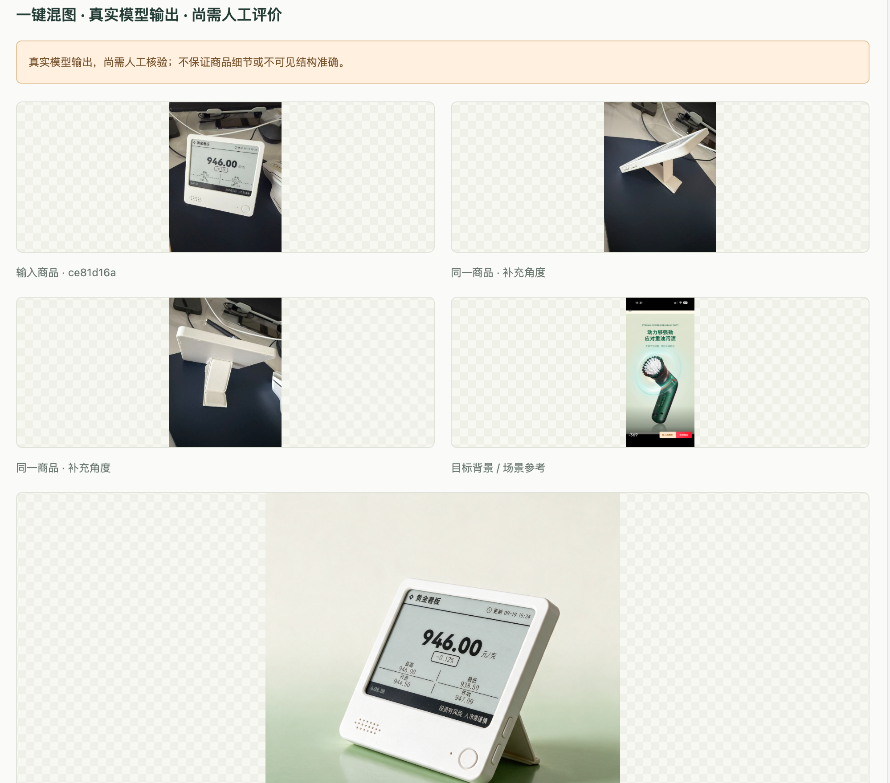

# Storm Studio.

**v0.1 Beta** · 本地商品图片快速生产工具。版本变更见 [CHANGELOG.md](CHANGELOG.md)。

本地单用户电商图片工作台。两个生产工具：**宣传图物料、说明书工业草图**。采用玻璃质感工作区，支持国内 Seedream 生图与本地 U²-Net 抠图；保留历史 Kimi 分析记录兼容。

## 效果展示

同一商品的正面、侧面与背面实拍，配合一张场景参考图，生成新的商品展示图。下面是工作台的实际输入与输出对照；生成结果仍需人工检查商品结构、屏幕文字和 Logo 等细节。



## 启动

Python 3.11，在项目根目录运行：

```sh
uv sync --locked
cp .env.example .env
uv run alembic upgrade head
uv run python scripts/setup_cutout.py
```

最后一条首次下载本地抠图权重，之后校验已安装文件，无需每次运行。

两个终端分别运行：

```sh
uv run uvicorn studio.web.app:app --host 127.0.0.1 --port 8765 --no-access-log
```

```sh
uv run python -m studio.worker
```

访问 [本地工作台](http://127.0.0.1:8765/)。仅绑定本机。Worker 必须具备外网权限才能调用真实模型，可在本机终端运行。两个终端各按 Ctrl+C 停止。

## 使用

首页选择一个工具，点击商品图片卡添加素材，也可直接拖入或粘贴；“图片资产”抽屉可随时展开管理。白底页用两张卡展示商品与成图；场景和工业草图页用三张卡展示商品、参考场景 / 补充角度和生成结果，下方展示本地真实作品。

- **宣传图物料**：单张商品实拍（白底阶段不接收辅助角度） → 纯净白底展示图 → 直接下载 / 抠图为透明 PNG；也可继续选择参考场景，通过混图生成自己的场景宣传图。混图结果不提供抠图入口。
- **说明书工业草图 · Beta**：同一商品的三视图或多角度实拍 → 纯净三视图线稿。用于说明书外观插图初稿，需人工核对并补充标注，不用于生产加工。

生成前预览图片、要求和调用次数，确认后才调用模型。混图多个商品时先确认首张，再授权剩余批量。已有作品从“历史作品”打开。

画布支持 1:1、3:4、4:3、4:5、5:4、2:3、3:2、9:16、16:9。返回首页再进入工具会开始空白任务，也可用右上角“新建任务”清空当前配置；资产和历史作品保留。

当前界面仅保留以上两条生产流程。旧实验接口和记录保留兼容，不作为当前工具入口。

## 配置

只读取本项目 `.env`，环境变量优先，密钥不显示在网页或导出中。填写 `MOONSHOT_API_KEY`、`ARK_API_KEY`，模型为 `kimi-k3` 与 `doubao-seedream-5-0-pro-260628`。配置项参见 `.env.example`；改配置后重启 Web 和 Worker。

```sh
uv run python -m studio.config
```

此命令仅显示配置是否已填写，不输出密钥。相对 `STUDIO_DATA_DIR` 以项目根目录为准。`.env`、模型和 `data/` 已被忽略，勿公开服务或上传本地凭据。

## 验证与边界

```sh
uv run pytest -q
uv run ruff check src tests migrations scripts
uv run ruff format --check src tests migrations scripts
node --check src/studio/web/static/app.js
node --test tests/frontend/*.cjs
```

自动测试禁止真实网络，供应商响应使用模拟数据。现有 `scripts/smoke.py` 可在 Web/Worker 启动后运行，仅产生本地 Fixture 记录。Fixture 不代表视觉生成效果。

模型可能改变细节；保留 Logo/结构是明确提示词约束，不是像素不变的保证。三视图无工程生产精度。本地抠图需检查边缘，暂无人工修边工具。真实任务无自动重试；未知结果需先核查账单。按次数确认，不提供金额预算保证，供应商侧需设置可接受的限制。只接收图片 base64 响应，不自动下载供应商返回的 URL。

详细新流程、批量语义、验证与后续能力见 [简化工作流](docs/SIMPLE_WORKFLOWS.md)。历史阶段见 [M1 报告](docs/M1_REPORT.md)、[M2 接入记录](docs/M2_INTEGRATION_REPORT.md)。

项目维护与已验证行为约束见 [HARNESS.md](HARNESS.md)。

## 说明书插图初稿

单张实拍可生成白底实物配图；一张主视图及最多五张补充角度可生成白底三视图线稿，用作说明书外观插图、部件说明底图及设计沟通草图。当前三视图为正视、侧视、俯视，不自动编写完整说明书。使用前需人工核对部件与视图一致性，再补充部件名称、尺寸或操作说明；输出不作为生产加工图。
